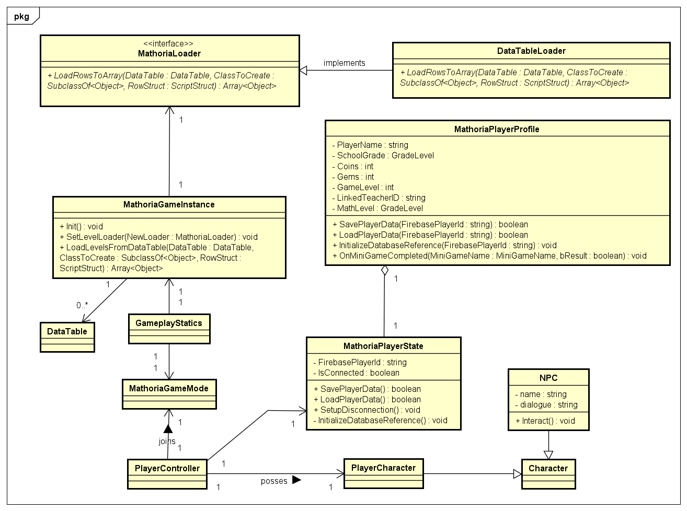

# Math Reinforcement Mini-Games

## Overview
Welcome to **Math Reinforcement Mini Games**, an engaging suite of mini-games designed to reinforce key math skills through fun, interactive gameplay. This README provides an overview of the project, development setup, and contribution guidelines. These mini-games aim to enhance mathematical learning by integrating educational concepts with immersive game mechanics. The mini-games cover a wide range of math topics, including arithmetic, geometry, logical reasoning, fractions, and quick calculations.

## Table of Contents
1. [Market Math](#market-math)
2. [Shape Builder](#shape-builder)
3. [Delivery Dash](#delivery-dash)
4. [Math Hoops](#math-hoops)
5. [System Components](#system-components)
6. [Installation Instructions](#installation-instructions)
7. [Teacher Dashboard Integration](#teacher-dashboard-integration)
8. [Important Update](#important-update)
9. [Contributing](#contributing)
10. [Contact](#contact)

---

## Market Math

### **Marketplace - 💰 Money Management**
**🕹️ Gameplay Mechanics**: 
- 🎯 **Goal**: Sell items, calculating totals, change, and discounts.
- 🛒 **Scenarios**: Act as a shopkeeper with interactive shopping tasks.

**🌍 World Setting & NPCs**:
- 📍 **Location**: Busy marketplace with stalls (vegetables, bakery, clothing).
- 👥 **NPCs**: Shopkeepers and customers requesting purchases.

**🎥 Camera Perspective & Movement**:
- 👁️ **Perspective**: Third-person, slightly above the player.
- 🎯 **Movement**: Follows the player smoothly, slight lag for a dynamic feel.

**🕹️ Player Controls & Actions**:
- 🚶‍♂️ **Movement**: Joystick (mobile) / WASD (PC).
- 🤝 **Interact**: Tap/click to speak with NPCs.
- 🔢 **UI**: Select or type numerical answers.

**🎁 Rewards System**:
- ✅ **Correct answers**:  Coins, XP (GameLevel).
- ⚡ **Fast, accurate responses**: Bonus Gems.

**🛠️ Unreal Engine Development Directives**:
- 🗝️ **Key Systems**:
   - 💬 **Dialogue System**: Integrated with random math problem prompts either calculating totals, change, or discounts.
   - 📦 **Inventory System**: Simple buying/selling mechanics.
   - 💰 **Currency System**: Track Coins/Gems.
- 🖼️ **UI Components**: Numeric keypad, answer submission panel.
- 🎬**Animation**: Idle animations, interactive triggers.

**🐈‍⬛ GitHub Branch**: `market`

---

## Shape Builder

### **Mechanic - 📏 Geometry Puzzle**

**🕹️ Gameplay Mechanics**:  
- 🎯 **Goal**: Help the Mechanic NPC find the correct car components based on geometric properties like surface area, perimeter, and shape type.
- 🛠️ **Scenarios**: Players choose from various components, analyzing their dimensions and properties to determine the correct fit.

**🌍 World Setting & NPCs**:  
- 📍 **Location**: Mechanic shop filled with machine parts and tools.
- 👥 **NPCs**: Mechanic providing geometry-based tasks and feedback on player choices.

**🎥 Camera Perspective & Movement**:
- 👁️ **Perspective**: Third-person, slightly above the player.
- 🎯 **Movement**: Follows the player smoothly, slight lag for a dynamic feel. 

**🕹️ Player Controls & Actions**:  
- 🚶‍♂️ **Movement**: Joystick (mobile) / WASD (PC).
- 👆 **Select Components**: Click to pick components from the Mechanic's shop inventory. 
- 🔄 **Analyze**: Check component details like perimeter and surface area.
- ✅ **Confirm Selection**: Submit the chosen components to the Mechanic for validation.

**🎁 Rewards System**:  
- 🎯 **Correct Selections**: Earn coins and XP based on accuracy.
- ⚡ **Quick, Precise Solutions**: Bonus gems for solving tasks quickly without errors.

**🛠️ Unreal Engine Development Directives**:  
- 🗝️ **Key Systems**:  
   - 📏 **Geometry Analyzer**: Calculates surface area, perimeter, and other properties.
   - 🧠 **Task Validator**: Checks if the selected components meet the Mechanic's requirements.
- 🖼️ **UI Components**: Component inventory panel, analysis button, and submission confirmation.
- 🎬 **Animation**: Highlight correct components with glowing effects upon selection.

**🐈‍⬛ GitHub Branch**: `builder`

---

## Delivery Dash

### **Police Station / Hospital - 🚚 Logical Sequences**
**🕹️ Gameplay Mechanics**: 
- 🎯 **Goal**: Deliver packages to correct locations using math-based clues.
- 🛒 **Scenarios**: Decode clues, navigate city, confirm deliveries.

**🌍 World Setting & NPCs**:
- 📍 **Location**: Low-poly 3D city with key landmarks.
- 👥 **NPCs**: Post officer or doctor assigning deliveries.

**🎥 Camera Perspective & Movement**:
- 👁️ **Perspective**: Third-person driving view.
- 🎯 **Movement**: Follows vehicle dynamically, slight tilt during turns.

**🕹️ Player Controls & Actions**:
- 🚗 Drive with joystick (mobile) / arrow keys (PC).
- 🗺️ Select locations on mini-map.
- ✅ Confirm deliveries at destinations.

**🎁 Rewards System**:
- 📦 **Correct deliveries**:  Coins, XP (GameLevel).
- ⚡ **Fast, accurate routes**: Bonus Gems.

**🛠️ Unreal Engine Development Directives**:
- 🗝️ **Key Systems**:
   - 🗺️ **Mini-Map System**: Real-time tracking of player and objectives.
   - 🚗 **Vehicle Controller**: Smooth physics-based driving mechanics.
   - 🧩 **Clue Logic System**: Dynamic math problem generation for clues.
- 🖼️ **UI Components**: Interactive mini-map, delivery checklist.
- 🌍 **World Design**: Optimized city layout for fun navigation.

**🐈‍⬛ GitHub Branch**: `delivery`

---

## Math Hoops

### **Basketball Court - 🏀 Quick Calculations (already in development as part of the course demonstration)**
**🕹️ Gameplay Mechanics**: 
- 🎯 **Goal**: Score baskets by solving quick math problems correctly.
- 🛒 **Scenarios**: Each successful answer gives the player a chance to shoot. The difficulty of the problem and shot increases as the player progresses.

**🌍 World Setting & NPCs**:
- 📍 **Location**: A lively basketball court with cheering NPCs.
- 👥 **NPCs**: Teammates and a coach giving math challenges. Opponents may appear in higher levels to add pressure.

**🎥 Camera Perspective & Movement**:
- 👁️ **Perspective**: Third-person, positioned slightly behind and above the player during shooting. Dynamic follow when moving around the court.
- 🎯 **Movement**: Follows the player with smooth transitions between solving problems and taking shots.

**🕹️ Player Controls & Actions**:
- 🤔 Solve math problems via multiple-choice or quick input.
- 🏃 Move with joystick (mobile) / WASD (PC).
- 🎯 Aim and shoot with a swipe (mobile) or mouse click/drag (PC).

**🎁 Rewards System**:
- ✅ **Correct answers and successful shots**:  Coins, XP (GameLevel).
- ⚡ **Streaks of correct answers**:  Bonus Gems and power-ups (like speed boost or accuracy aid).

**🛠️ Unreal Engine Development Directives**:
- 🗝️ **Key Systems**:
   - 🔢 **Quick Math Problem Generator**: Generates rapid-fire math questions tailored to player grade level.
   - 🏀 **Basketball Shooting Mechanic**: Physics-based system for aiming and shooting.
   - 🔥 **Combo System**: Rewards streaks with visual effects and bonus points
- 🖼️ **UI Components**: Timer bar, score tracker, quick answer buttons.
- 🎬**Animation**: Dribbling, shooting, celebratory animations after successful shots.

**🐈‍⬛ GitHub Branch**: `hoops`

---

## System Components

### ⚙️ **Existing Classes & Structures**

- **`ANPC`**: Base class for non-playable characters (NPCs) that guide players.
- **`UMathoriaGameInstance`, `UMathoriaPlayerProfile`, `AMathoriaPlayerState`**: Core player data and game management.
- **`UMathoriaGameInstance`**: Manages overall game state, player data, and progression.
- **`UMathoriaPlayerProfile`**: Stores player-specific data such as player name, XP,  achievements, levels, and preferences.
- **`AMathoriaPlayerState`**: Tracks current player profile and session data.

For a detailed explanation of the class structure, please refer to the diagram above.

### ⚙️ **Insights and Hints about Classes and Structures Needed**

#### 🧠 **NPC & Interaction System**
- **`ANPC`** *(Base Class)*: Manages basic NPC behavior, dialogue, and interaction triggers, and is extended into specific NPC types for each mini-game.
- **`UDialogueComponent`**: Handles dialogues and interactions between the player and NPCs.
- **NPC Child Classes**:

   **1. `AMarketNPC` (Market Math Mini-Game)**
   - **Role**: Represents shopkeepers and customers in the marketplace.
   - **Attributes**:
   - `ShopType`: The type of shop (e.g. bakery, clothing store).
   - `CustomerRequest`: The math problem or purchase request the customer presents.
   - **Methods**:
   - `GeneratePurchaseRequest()`: Generates a math problem (e.g., total cost, change, or discount).
   - `ProvideFeedback()`: Gives feedback to the player based on their response (correct/incorrect).

   **2. `AMechanicNPC` (Shape Builder Mini-Game)**  
   - **Role**: Represents the mechanic who provides geometry-based tasks.
   - **Attributes**:
   - `RequiredProperties`: Defines the geometric properties needed for the task (e.g., surface area, perimeter).
   - `PuzzleDifficulty`: The difficulty level of the task.
   - **Methods**:
   - `ProvideComponentTask()`: Assigns a task to the player to find specific car components.
   - `ValidateSelection()`: Checks if the player's selected components match the required properties.

   **3. `APostOfficerNPC` (Delivery Dash Mini-Game)**
   - **Role**: Represents the post officer or doctor who assigns delivery tasks.
   - **Attributes**:
   - `DeliveryLocation`: The destination for the delivery.
   - `Clue`: The math-based clue the player must solve to find the delivery location.
   - **Methods**:
   - `AssignDeliveryTask()`: Assigns a delivery task with a math-based clue.
   - `ConfirmDelivery()`: Validates if the player has delivered to the correct location.

   **4. `ACoachNPC` (Math Hoops Mini-Game)**
   - **Role**: Represents the coach or teammate who provides quick math challenges.
   - **Attributes**:
   - `MathProblem`: The quick math problem the player must solve.
   - `DifficultyLevel`: The difficulty of the math problem (increases as the player progresses).
   - **Methods**:
   - `GenerateMathProblem()`: Generates a quick math problem for the player to solve.
   - `ProvideShootingOpportunity()`: Allows the player to shoot a basket if they solve the problem correctly.

#### 🗺️ **World & Environment Management**
- **`AMiniGameMap`**: Defines unique environments for each mini-game (Market, Garden, City, etc.).
- **`UObjectSpawner`**: Dynamically spawns items, puzzles, or NPCs based on game scenarios.
- **`ULocationManager`**: Manages different in-game locations and transitions between them.

#### 📊 **Math Problem Generation & Validation**
- **`UMathProblemGenerator`**: Generates math problems tailored to math skill level.
- **`UMathValidator`**: Validates player answers and triggers corresponding feedback mechanisms.
- **`UAdaptiveDifficultySystem`**: Adjusts the difficulty of problems based on player performance.

#### 🕹️ **Mini-Game Controllers**
- **`AMarketMathController`**: Handles logic for the Market Math mini-game, including transactions and currency management.
- **`AShapeBuilderController`**: Manages shape construction mechanics and puzzle validation.
- **`ADeliveryDashController`**: Controls delivery missions, vehicle navigation, and clue decoding.
- **`AMathHoopsController`**: Manages quick calculation challenges, shooting mechanics, and combo scoring.

#### 🏆 **Rewards & Progression Systems**
- **`URewardSystem`**: Distributes rewards such as coins, XP, and gems based on performance.
- **`UComboSystem`**: Encourages streaks of correct answers, offering bonus points and power-ups (Math Hoops mini-game).

#### 📈 **Analytics & Learning Insights**
- **`UAnalyticsManager`**: Collects gameplay data for performance analysis.
- **`ULearningProgressTracker`**: Monitors educational progress, highlighting strengths and areas for improvement.
- **`UTeacherDashboardAPI`**: Facilitates data synchronization with the Teacher Dashboard for real-time performance tracking.

#### 📱 **User Interface Components**
- **`WBP_HUDManager`**: Manages in-game UI elements like scoreboards, timers, and progress bars.
- **`WBP_NPC_Dialogue`**: Displays interactive dialogues with NPCs.
- **`WBP_MiniGame`**: Tailored UI layouts for each mini-game, including answer panels, inventory, and mini-maps.

---

## Teacher Dashboard Integration

- **Real-Time Monitoring of Student Performance**: Track student performance in real-time while they are engaging with the mini-games.
- **Analytics & Reports**: Teachers have access to detailed analytics, showing student progress, areas of strength, and areas for improvement. Reports can be generated based on student performance, helping educators adjust teaching strategies as needed.
- **Link to GitHub Repo**: [GitHub Repository for Teacher Dashboard](https://github.com/najlae01/math-web.git)

---

## Important Update 
We are making a key change to how students/players create and access their game accounts. Going forward, students will not be able to create accounts themselves—only teachers or school administrators can do so.

To streamline this process, we are removing the in-game authentication form. Instead, students will log in using a QR code provided by their teacher upon account creation.

In the future, we plan to introduce fingerprint authentication as an option for compatible devices.

---

## Installation Instructions

1. Clone or download the project files from the repository.
   `git clone -b hoops https://github.com/najlae01/math-skills-reinforcement.git`

2. **Create a Firebase Console Account:**
   - Go to [Firebase Console](https://console.firebase.google.com/).
   - Create a new project named "Math Reinforcement Game."

3. **Add Android and Web Apps:**
   - In your Firebase project settings, add an Android app and a Web app.

4. **Enable Authentication:**
   - Go to "Authentication" and enable Email and Google sign-in methods.

5. **Configure Realtime Database:**
   - Enable "Realtime Database" and set up the rules as needed.

6. **Download Configuration File:**
   - In "Project Settings" under Android apps, download the `google-services.json` file.
   - Add your Developer SHA Certificate Fingerprints for Android.

7. **Organize Project Files:**
   - Create a `Services` folder in the project directory and place `google-services.json` inside.
   - Create a `Plugins` folder and add shared Firebase and QrReader plugins there.

8. **Build the Project:**
   - Right-click the `.uproject` file.
   - Choose "Show more options" > "Generate Visual Studio Project files."
   - Open the `.sln` file in Visual Studio and build the project.

9. **Run the Game:**
   - After a successful build, open the `.uproject` file and run the game.

---

## Contributing

We welcome contributions to improve these mini-games!

1. Fork the repository.
2. Create your group branch (`git checkout -b group-one`).
3. Commit your changes (`git commit -am 'Add group-one'`).
4. Push to your branch (`git push origin group-one`).
5. Open a pull request with detailed descriptions of your changes.

---

## Contact

For support, contact [Najlae](mailto:najlae.abarghache@etu.uae.ac.ma).